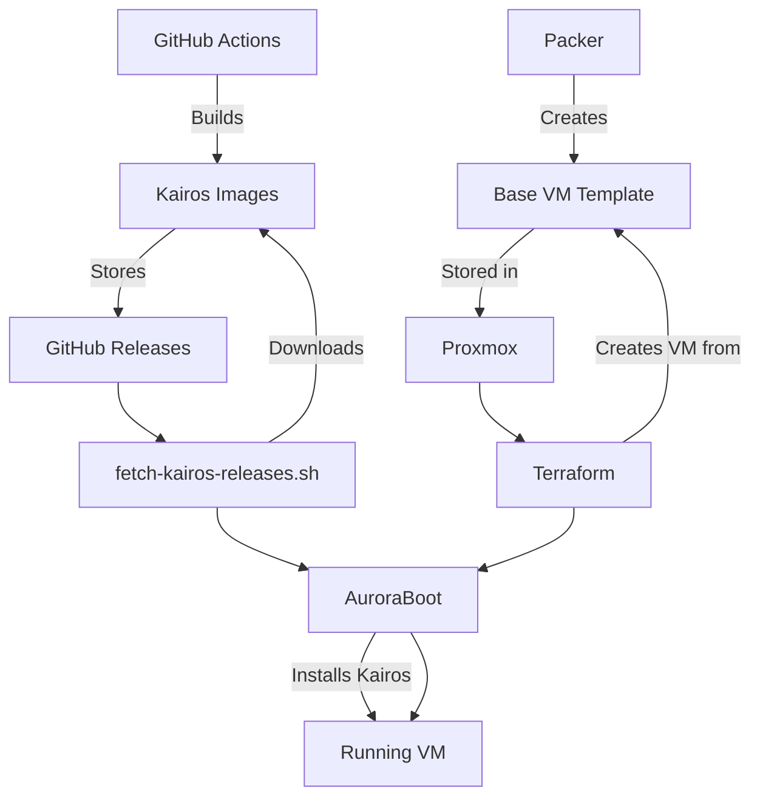

# Proxmox VM Deployment with AuroraBoot for Kairos

A comprehensive guide for automated Proxmox VM creation and Kairos OS deployment using Infrastructure as Code (IaC) principles with Terraform, Packer, and AuroraBoot.

## Table of Contents

- [Overview](#overview)
- [Prerequisites](#prerequisites)
- [Quick Start](#quick-start)
- [Architecture](#architecture)
- [Configuration](#configuration)
- [Deployment Methods](#deployment-methods)
- [Advanced Usage](#advanced-usage)
- [Troubleshooting](#troubleshooting)
- [Maintenance](#maintenance)

## Overview

This automation framework provides enterprise-grade deployment of Kairos OS on Proxmox VMs using:

- **Terraform**: Infrastructure provisioning and VM management
- **Packer**: Base VM template creation with cloud-init support
- **AuroraBoot**: Zero-touch Kairos OS installation
- **GitHub Actions**: Automated Kairos image building and releases

### Key Features

- ✅ **Fully Automated**: End-to-end VM creation and Kairos deployment
- ✅ **Enterprise Ready**: Security hardening and compliance built-in
- ✅ **Multi-Stage Pipeline**: Template creation, VM provisioning, OS installation
- ✅ **GitHub Integration**: Automatic fetching of latest Kairos releases
- ✅ **Scalable**: Deploy single VMs or entire clusters
- ✅ **Reproducible**: Infrastructure as Code with versioning

## Prerequisites

### System Requirements

**Control Machine** (where you run the deployment):
- Linux, macOS, or Windows with WSL2
- 8GB+ RAM (for building templates)
- 20GB+ free disk space
- Network connectivity to Proxmox and internet

**Proxmox Environment**:
- Proxmox VE 7.0+ or 8.0+
- API access enabled
- Storage pools configured (local-lvm recommended)
- Network bridges configured
- ISO storage available

**Target VM Requirements**:
- 4GB+ RAM (8GB+ recommended)
- 32GB+ disk space (64GB+ recommended)
- UEFI boot support
- Network connectivity

### Required Tools

Install the following tools on your control machine:

```bash
# Ubuntu/Debian
sudo apt update
sudo apt install -y curl wget jq yq git docker.io

# Install Terraform
curl -fsSL https://apt.releases.hashicorp.com/gpg | sudo apt-key add -
sudo apt-add-repository "deb [arch=amd64] https://apt.releases.hashicorp.com $(lsb_release -cs) main"
sudo apt update && sudo apt install terraform

# Install Packer
sudo apt install packer

# Install GitHub CLI
curl -fsSL https://cli.github.com/packages/githubcli-archive-keyring.gpg | sudo dd of=/usr/share/keyrings/githubcli-archive-keyring.gpg
echo "deb [arch=$(dpkg --print-architecture) signed-by=/usr/share/keyrings/githubcli-archive-keyring.gpg] https://cli.github.com/packages stable main" | sudo tee /etc/apt/sources.list.d/github-cli.list
sudo apt update && sudo apt install gh

# macOS with Homebrew
brew install terraform packer docker jq yq gh
```

### Proxmox Configuration

1. **Create API Token**:
   ```bash
   # In Proxmox web interface:
   # Datacenter → Permissions → API Tokens
   # Add new token with appropriate permissions
   ```

2. **Configure Permissions**:
   ```bash
   # Required permissions for the API user/token:
   # - VM.Allocate, VM.Clone, VM.Config.Disk, VM.Config.HWType
   # - VM.Config.Memory, VM.Config.Network, VM.Config.Options
   # - VM.Monitor, VM.Audit, VM.PowerMgmt
   # - Datastore.Allocate, Datastore.AllocateSpace
   # - SDN.Use (if using SDN)
   ```

3. **Verify Storage**:
   ```bash
   # Ensure required storage pools exist:
   # - local-lvm (or equivalent for VM disks)
   # - local (for ISOs and templates)
   ```

## Quick Start

### 1. Clone Repository

```bash
git clone https://github.com/your-org/beyond-devops-os-factory.git
cd beyond-devops-os-factory
```

### 2. Configure Environment

```bash
# Set required environment variables
export PROXMOX_API_URL="https://your-proxmox-server:8006/api2/json"
export PROXMOX_API_TOKEN="user@realm!tokenname=your-secret-token"
export PROXMOX_NODE="pve"  # Your Proxmox node name
export GITHUB_REPO="your-org/beyond-devops-os-factory"

# Optional: Save to .env file
cat > .env << EOF
PROXMOX_API_URL=https://your-proxmox-server:8006/api2/json
PROXMOX_API_TOKEN=user@realm!tokenname=your-secret-token
PROXMOX_NODE=pve
GITHUB_REPO=your-org/beyond-devops-os-factory
EOF

source .env
```

### 3. Authenticate with GitHub

```bash
# Authenticate GitHub CLI (for fetching releases)
gh auth login
```

### 4. Quick Deployment

```bash
# Complete deployment with default settings
./scripts/proxmox/deploy-kairos-vm.sh full-deploy

# Or deploy with custom VM name
./scripts/proxmox/deploy-kairos-vm.sh full-deploy --name my-kairos-vm
```

### 5. Verify Deployment

```bash
# Check deployment status
./scripts/proxmox/deploy-kairos-vm.sh status

# SSH to the VM (once network is up)
ssh kairos@<vm-ip>

# Check Kubernetes cluster
kubectl get nodes
```

## Architecture

### Deployment Pipeline



### Component Overview

1. **Packer Phase**: Creates optimized VM template with:
   - Ubuntu base OS with cloud-init
   - Docker and container tools
   - QEMU guest agent
   - AuroraBoot preparation scripts

2. **Image Fetch Phase**: Downloads Kairos artifacts:
   - ISO images for bootable deployment
   - RAW/QCOW2 images for direct deployment
   - Checksums and signatures for verification

3. **Terraform Phase**: Provisions VM infrastructure:
   - Creates VM from Packer template
   - Configures hardware (CPU, memory, disk, network)
   - Sets up cloud-init configuration
   - Manages VM lifecycle

4. **AuroraBoot Phase**: Installs Kairos OS:
   - Zero-touch automated installation
   - Applies enterprise cloud-config
   - Configures K3s Kubernetes cluster
   - Enables monitoring and health checks

### Directory Structure

```
beyond-devops-os-factory/
├── terraform/proxmox/          # Terraform configurations
│   ├── main.tf                # Provider and basic config
│   ├── variables.tf           # Input variables
│   ├── outputs.tf             # Output values
│   ├── vm.tf                  # VM resource definitions
│   └── terraform.tfvars.example
├── packer/proxmox/             # Packer templates
│   ├── kairos-base.pkr.hcl    # Main template definition
│   ├── variables.pkr.hcl      # Packer variables
│   ├── http/                  # Cloud-init files
│   └── scripts/               # Provisioning scripts
├── auroraboot/                 # AuroraBoot configurations
│   ├── cloud-config.yaml     # Kairos cloud configuration
│   ├── config.yaml            # AuroraBoot settings
│   └── deploy-proxmox.sh      # Deployment script
└── scripts/                   # Automation scripts
    ├── github/                # GitHub integration
    └── proxmox/               # Proxmox deployment
```

## Configuration

### Terraform Configuration

Edit `terraform/proxmox/terraform.tfvars`:

```hcl
# Proxmox connection
proxmox_api_url      = "https://your-proxmox:8006/api2/json"
proxmox_api_token    = "user@realm!tokenname=secret"
proxmox_node_name    = "pve"

# VM configuration
vm_name          = "kairos-production-01"
vm_cpu_cores     = 4
vm_memory        = 8192  # 8GB
vm_disk_size     = "64G"
vm_storage       = "local-lvm"

# Network configuration
vm_network_bridge = "vmbr0"
vm_network_vlan   = 100  # Optional VLAN ID

# Kairos configuration
kairos_github_repo   = "your-org/beyond-devops-os-factory"
kairos_image_version = "latest"  # or specific version like "v1.2.0"
```

### AuroraBoot Cloud Configuration

Edit `auroraboot/cloud-config.yaml`:

```yaml
#cloud-config
hostname: kairos-{{ trunc 4 .MachineID }}

# User configuration
users:
- name: kairos
  passwd: kairos
  groups: [admin, docker]
  ssh_authorized_keys:
  - github:your-github-username

# Network configuration (update for your environment)
network:
  version: 2
  ethernets:
    ens18:
      dhcp4: true

# K3s cluster configuration
k3s:
  enabled: true
  args:
  - --disable=traefik,servicelb
  - --cluster-init
  - --tls-san=192.168.1.100  # Update with your IP

# Enterprise features
write_files:
- content: |
    #!/bin/bash
    systemctl is-active k3s || exit 1
    curl -k https://localhost:6443/healthz || exit 1
    echo "Cluster healthy"
  path: /usr/local/bin/health-check.sh
  permissions: "0755"
```

### Packer Variables

Edit `packer/proxmox/variables.pkr.hcl` or set environment variables:

```bash
export PROXMOX_API_URL="https://your-proxmox:8006/api2/json"
export PROXMOX_API_TOKEN_ID="user@realm!tokenname"
export PROXMOX_API_TOKEN_SECRET="your-secret"
export PROXMOX_NODE="pve"
```

## Deployment Methods

### Method 1: Full Automated Deployment

Complete end-to-end deployment:

```bash
# Full deployment with defaults
./scripts/proxmox/deploy-kairos-vm.sh full-deploy

# Full deployment with custom options
./scripts/proxmox/deploy-kairos-vm.sh full-deploy \
  --name kairos-prod-01 \
  --version v1.2.0 \
  --tf-vars ./custom.tfvars
```

### Method 2: Step-by-Step Deployment

Deploy individual components:

```bash
# 1. Build Packer template (one-time setup)
./scripts/proxmox/deploy-kairos-vm.sh template-only

# 2. Deploy VM with Terraform
./scripts/proxmox/deploy-kairos-vm.sh vm-only --name my-vm

# 3. Install Kairos with AuroraBoot
./scripts/proxmox/deploy-kairos-vm.sh kairos-only --name my-vm
```

### Method 3: Manual Component Usage

Use components individually:

```bash
# Manual Terraform deployment
cd terraform/proxmox
terraform init
terraform plan -var-file=terraform.tfvars
terraform apply

# Manual Packer build
cd packer/proxmox
packer build -var-file=variables.pkr.hcl kairos-base.pkr.hcl

# Manual AuroraBoot deployment
cd auroraboot
./deploy-proxmox.sh --name my-vm --version latest
```

### Method 4: CI/CD Integration

GitHub Actions workflow example:

```yaml
name: Deploy Kairos to Proxmox
on:
  workflow_dispatch:
    inputs:
      vm_name:
        description: 'VM Name'
        required: true
        default: 'kairos-auto'

jobs:
  deploy:
    runs-on: ubuntu-latest
    steps:
    - uses: actions/checkout@v4
    
    - name: Setup tools
      run: |
        # Install terraform, packer, etc.
        
    - name: Deploy Kairos VM
      env:
        PROXMOX_API_URL: ${{ secrets.PROXMOX_API_URL }}
        PROXMOX_API_TOKEN: ${{ secrets.PROXMOX_API_TOKEN }}
      run: |
        ./scripts/proxmox/deploy-kairos-vm.sh full-deploy \
          --name ${{ github.event.inputs.vm_name }}
```

## Advanced Usage

### Multi-VM Cluster Deployment

Deploy a Kairos cluster:

```bash
# Deploy multiple VMs for HA cluster
for i in {1..3}; do
  ./scripts/proxmox/deploy-kairos-vm.sh full-deploy \
    --name "kairos-cluster-0$i" \
    --skip-template  # Skip after first VM
done
```

### Custom Cloud Configuration

Create specialized configurations:

```bash
# Development environment
cp auroraboot/cloud-config.yaml auroraboot/cloud-config-dev.yaml
# Edit for development settings...

./scripts/proxmox/deploy-kairos-vm.sh kairos-only \
  --cloud-config ./auroraboot/cloud-config-dev.yaml
```

### Network Boot Deployment

Use PXE boot for bare metal or specific scenarios:

```bash
# Configure for network boot
./auroraboot/deploy-proxmox.sh \
  --method network \
  --name kairos-netboot
```

### Monitoring and Alerting Integration

Set up monitoring webhooks:

```bash
# Configure webhook notifications
export WEBHOOK_URL="https://hooks.slack.com/your/webhook"

./scripts/github/monitor-releases.sh \
  --webhook "$WEBHOOK_URL" \
  --interval 300
```

## Troubleshooting

### Common Issues

#### Packer Build Failures

**Issue**: Packer build fails with permission errors
```bash
# Solution: Verify API token permissions
curl -k -H "Authorization: PVEAPIToken=${PROXMOX_API_TOKEN}" \
  "${PROXMOX_API_URL}/nodes/${PROXMOX_NODE}/qemu"
```

**Issue**: ISO download fails during Packer build
```bash
# Solution: Pre-download ISO to Proxmox
wget https://releases.ubuntu.com/22.04/ubuntu-22.04.4-live-server-amd64.iso
# Upload via Proxmox web interface to local storage
```

#### Terraform Deployment Issues

**Issue**: VM creation fails with "template not found"
```bash
# Solution: Verify Packer template was created
pvesh get /nodes/${PROXMOX_NODE}/qemu --output-format json | jq '.[] | select(.name | contains("kairos-base"))'
```

**Issue**: Network configuration problems
```bash
# Solution: Verify bridge configuration
pvesh get /nodes/${PROXMOX_NODE}/network
# Check bridge exists and is active
ip link show vmbr0
```

#### AuroraBoot Deployment Issues

**Issue**: Images not found for deployment
```bash
# Solution: Manually fetch images
./scripts/github/fetch-kairos-releases.sh \
  --repo your-org/beyond-devops-os-factory \
  --version latest \
  --force
```

**Issue**: Cloud-config validation fails
```bash
# Solution: Validate YAML syntax
yq eval '.' auroraboot/cloud-config.yaml
cloud-init devel schema --config-file auroraboot/cloud-config.yaml
```

#### VM Boot and Runtime Issues

**Issue**: VM doesn't boot after deployment
```bash
# Check in Proxmox console:
# 1. Verify UEFI settings
# 2. Check boot order
# 3. Look at console output

# Reset EFI variables if needed
qm set <vmid> -efidisk0 local-lvm:vm-<vmid>-disk-1,efitype=4m,pre-enrolled-keys=0
```

**Issue**: Network connectivity problems
```bash
# SSH to VM and check:
ip addr show
systemctl status networking
journalctl -u cloud-init
```

**Issue**: K3s not starting
```bash
# Check K3s status
sudo systemctl status k3s
sudo journalctl -u k3s -f

# Check node resources
free -h
df -h
```

### Debug Mode

Enable verbose logging for troubleshooting:

```bash
# Enable debug logging
export TF_LOG=DEBUG
export PACKER_LOG=1

# Run with debug output
./scripts/proxmox/deploy-kairos-vm.sh full-deploy --dry-run
```

### Log Analysis

Check various log files:

```bash
# Deployment logs
tail -f /tmp/deploy-kairos-vm.log

# Terraform logs
tail -f terraform/proxmox/terraform.log

# AuroraBoot logs
tail -f /tmp/auroraboot-proxmox-deploy.log

# VM logs (after SSH access)
sudo journalctl -f
sudo tail -f /var/log/cloud-init.log
```

## Maintenance

### Regular Tasks

#### Update Kairos Images

```bash
# Check for new releases
./scripts/github/monitor-releases.sh --once

# Update to latest version
./scripts/github/fetch-kairos-releases.sh --force
```

#### Update Packer Template

```bash
# Rebuild template with latest base image
./scripts/proxmox/deploy-kairos-vm.sh template-only --force
```

#### Backup Configurations

```bash
# Backup Terraform state
cp terraform/proxmox/terraform.tfstate backup/

# Backup VM configurations
pvesh get /nodes/${PROXMOX_NODE}/qemu/${VMID}/config > backup/vm-${VMID}-config.txt
```

### Automated Monitoring

Set up continuous monitoring:

```bash
# Start release monitor
./scripts/github/monitor-releases.sh --daemon

# Setup systemd service (optional)
sudo ./scripts/github/monitor-releases.sh --setup
sudo systemctl enable kairos-release-monitor
sudo systemctl start kairos-release-monitor
```

### Cleanup

Remove deployed resources:

```bash
# Clean up specific deployment
./scripts/proxmox/deploy-kairos-vm.sh cleanup

# Manual cleanup
cd terraform/proxmox
terraform destroy -auto-approve
```

### Scaling Operations

#### Horizontal Scaling

```bash
# Deploy additional cluster nodes
for i in {4..6}; do
  ./scripts/proxmox/deploy-kairos-vm.sh vm-only \
    --name "kairos-worker-0$i" \
    --skip-template
done
```

#### Vertical Scaling

```bash
# Update VM resources via Terraform
# Edit terraform.tfvars:
# vm_cpu_cores = 8
# vm_memory = 16384

cd terraform/proxmox
terraform plan
terraform apply
```

### Security Updates

#### Update Base Template

```bash
# Rebuild template with security updates
./scripts/proxmox/deploy-kairos-vm.sh template-only --force

# Deploy new VMs with updated template
./scripts/proxmox/deploy-kairos-vm.sh vm-only --name kairos-updated
```

#### Rotate API Tokens

```bash
# Create new API token in Proxmox
# Update environment variables
export PROXMOX_API_TOKEN="user@realm!newtoken=newsecret"

# Test connectivity
curl -k -H "Authorization: PVEAPIToken=${PROXMOX_API_TOKEN}" \
  "${PROXMOX_API_URL}/version"
```

---

## Summary

This comprehensive Proxmox deployment system provides:

- **Automated Infrastructure**: Complete VM lifecycle management
- **Enterprise Security**: Built-in hardening and compliance
- **Scalable Architecture**: Single VMs to multi-node clusters  
- **CI/CD Integration**: GitHub Actions compatible workflows
- **Monitoring**: Built-in health checks and alerting
- **Maintainable**: IaC principles with version control

The system significantly reduces deployment time from hours to minutes while ensuring consistency, security, and repeatability across all environments.

For additional support or customization needs, refer to the troubleshooting section or create an issue in the project repository.